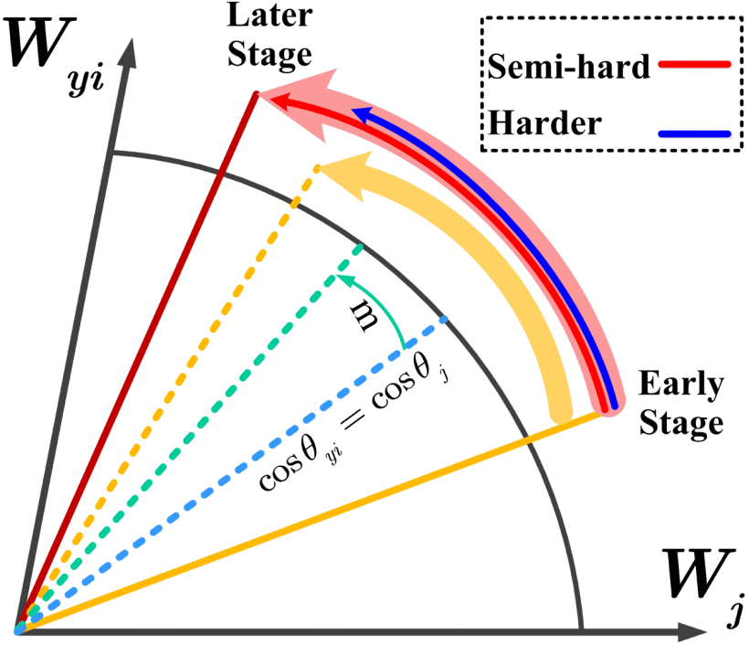

## 
 ——2022级博士研究生——

### · 研究方向
EEG脑电信号处理，脑机接口

### · 邮箱
jiaqi.wang@mail.nwpu.edu.cn

### · 代表论文

| 方法                | 题目                                                         | 链接                       |
| ----------------------- | ------------------------------------------------------------ | -------------------------- |
|  | **Jiaqi Wang**, Chen Zheng, Xiaohui Yang, Lijun Yang, EnhanceFace: Adaptive Weighted SoftMax Loss for Deep Face Recognition. IEEE Signal Processing Letters, 2022, 29: 65-69. |[[PaperLink]](https://ieeexplore.ieee.org/document/9601307/authors#citations) |

### · 出版论文
[1] Jiaqi Wang, Chen Zheng, Xiaohui Yang, Lijun Yang, EnhanceFace: Adaptive Weighted SoftMax Loss for Deep Face Recognition. IEEE Signal Processing Letters, 2022, 29: 65-69.

