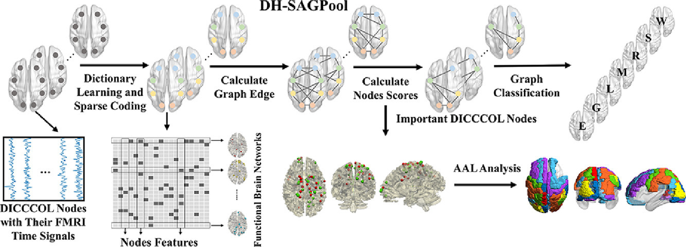
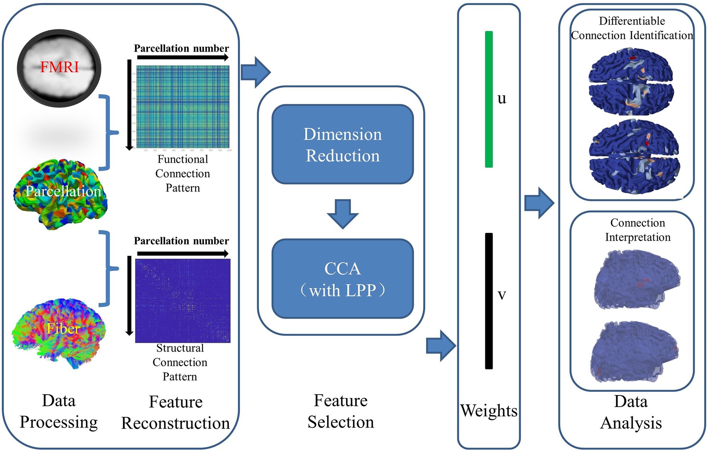
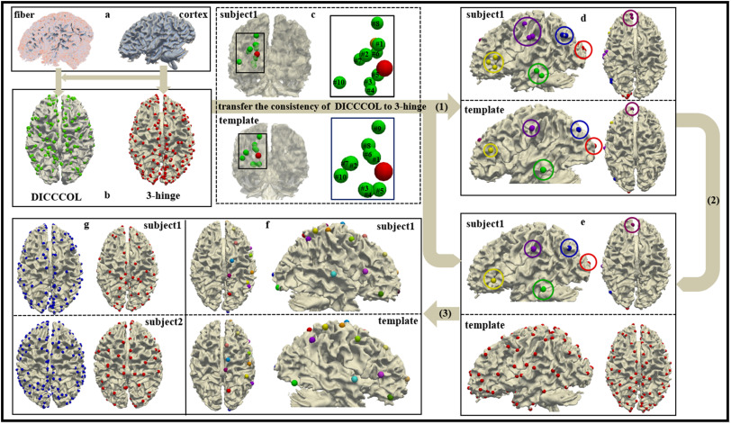
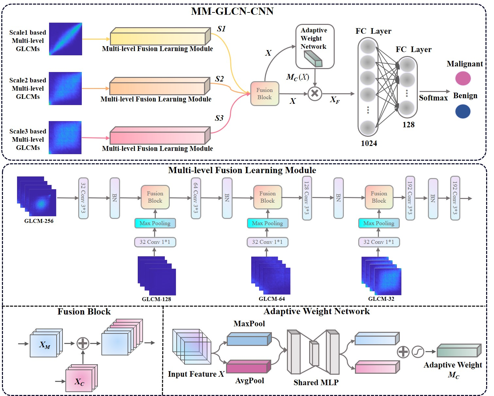

## 
 ——2021级博士研究生——

### · 研究方向
博士研究生：自然刺激和大脑功能状态联合研究。

### · 邮箱
sgyu@mail.nwpu.edu.cn

### · 代表论文

| 方法                | 题目                                                         | 链接                       |
| ----------------------- | ------------------------------------------------------------ | -------------------------- |
|  | **Sigang Yu**, Enze Shi, Ruoyang Wang, Shijie Zhao, Tianming Liu, Xi Jiang, Shu Zhang. A hybrid learning framework for fine-grained interpretation of brain spatiotemporal patterns during naturalistic functional magnetic resonance imaging. Frontiers in Human Neuroscience, 2022, 16. | [[PaperLink]](https://www.frontiersin.org/articles/10.3389/fnhum.2022.944543/full) [[Code]]() |
|  | Shu Zhang, Lin Wu, **Sigang Yu**, Enze Shi, Ning Qiang, Huan Gao, Jingyi Zhao, Shijie Zhao. An Explainable and Generalizable Recurrent Neural Network Approach for Differentiating Human Brain States on EEG Dataset[J]. IEEE Transactions on Neural Networks and Learning Systems, 2022: 1-12. | [[PaperLink]](https://ieeexplore.ieee.org/abstract/document/9940311) [[Code]]() |
|  | Shu Zhang, Junxin Wang, **Sigang Yu**, Ruoyang Wang, Junwei Han, Shijie Zhao, Tianming Liu, Jinglei Lv. An explainable deep learning framework for characterizing and interpreting human brain states[J]. Medical Image Analysis, 2023, 83: 102665. | [[PaperLink]](https://www.sciencedirect.com/science/article/abs/pii/S1361841522002936) [[Code]]() |
|  | Shu Zhang, Zhibin He, Lei Du, Yin Zhang, **Sigang Yu**, Ruoyang Wang, Xintao Hu, Xi Jiang, Tuo Zhang. Joint Analysis of Functional and Structural Connectomes Between Preterm and Term Infant Brains via Canonical Correlation Analysis with Locality Preserving Projection[J]. Frontiers in Neuroscience, 2021, 15. | [[PaperLink]](https://www.frontiersin.org/articles/10.3389/fnins.2021.724391/full) [[Code]]() |
|  | Shu Zhang, Ruoyang Wang, Zhen Han, **Sigang Yu**, Huan Gao, Xi Jiang, Tuo Zhang. A DICCCOL-based K-nearest landmark detection method for identifying common and consistent 3-hinge gyral folding landmarks[J]. Chaos, Solitons & Fractals, 2022, 158: 112018. | [[PaperLink]](https://www.sciencedirect.com/science/article/abs/pii/S0960077922002284) [[Code]]() |
|  | Shu Zhang, Yanqing Kang, **Sigang Yu**, Jinru Wu, Enze Shi, Ruoyang Wang, Zhibin He, Lei Du, Tuo Zhang. A Novel Two-Stage Multi-view Low-Rank Sparse Subspace Clustering Approach to Explore the Relationship Between Brain Function and Structure. Machine Learning in Medical Imaging: 13th International Workshop, MLMI 2022, Singapore. Cham: Springer Nature Switzerland, 2022: 191-200. | [[PaperLink]](https://link.springer.com/chapter/10.1007/978-3-031-21014-3_20) [[Code]]() |
|  | Shu Zhang, Jinru Wu, **Sigang Yu**, Ruoyang Wang, Enze Shi, Yongfeng Gao, Zhengrong Liang. A Bagging Strategy-Based Multi-scale Texture GLCM-CNN Model for Differentiating Malignant from Benign Lesions Using Small Pathologically Proven Dataset[C]//Multiscale Multimodal Medical Imaging: Third International Workshop, MMMI 2022, Singapore. Cham: Springer Nature Switzerland, 2022:44-53. | [[PaperLink]](https://link.springer.com/chapter/10.1007/978-3-031-18814-5_5) [[Code]]() |
|  | Shu Zhang, Haiyang Zhang, Ruoyang Wang, Yanqing Kang, **Sigang Yu**. A Novel Multi-Modality Framework for Exploring Brain Connectivity Hubs Via Reinforcement Learning Approach. International Symposium on Biomedical Imaging (ISBI), 2022. (Accepted) | [[PaperLink]]() [[Code]]() |
|  | Shu Zhang\*, Enze Shi\*, Lin Wu, Ruoyang Wang, **Sigang Yu**, Zhengliang Liu, Shaochen Xu, Tianming Liu, Shijie Zhao. Differentiating Brain States via Multi-clip Random Fragment Strategy-Based Interactive Bidirectional Recurrent Neural Network. Neural Networks, 2023. (Under Review) | [[PaperLink]]() [[Code]]() |
|  | Enze Shi, **Sigang Yu**, Yanqing Kang, Jinru Wu, Lin Zhao, Weizhong Liu, Dajiang Zhu, Jinglei Lv, Tianming Liu, Xintao Hu, Shu Zhang. MEET: Multi-band EEG Transformer. IEEE Transactions on Biomedical Engineering (T-BME), 2023. (Under Review) | [[PaperLink]]() [[Code]]() |
|  | Shu Zhang, Jinru Wu, Enze Shi, **Sigang Yu**, Yongfeng Gao, Lihong Connie Li, Licheng Ryan Kuo, Zhengrong Liang. MM-GLCM-CNN: A Multi-scale and Multi-level based GLCM-CNN for Polyp Classification. Computerized Medical Imaging and Graphics, 2023. (Under Review) | [[PaperLink]]() [[Code]]() |

### · 出版论文
[1] *Sigang Yu*, Enze Shi, Ruoyang Wang, Shijie Zhao, Tianming Liu, Xi Jiang, Shu Zhang. A hybrid learning framework for fine-grained interpretation of brain spatiotemporal patterns during naturalistic functional magnetic resonance imaging[J]. Frontiers in Human Neuroscience, 2022, 16.

[2] Shu Zhang, Lin Wu, *Sigang Yu*, Enze Shi, Ning Qiang, Huan Gao, Jingyi Zhao, Shijie Zhao. An Explainable and Generalizable Recurrent Neural Network Approach for Differentiating Human Brain States on EEG Dataset[J]. IEEE Transactions on Neural Networks and Learning Systems, 2022: 1-12.

[3] Shu Zhang, Junxin Wang, *Sigang Yu*, Ruoyang Wang, Junwei Han, Shijie Zhao, Tianming Liu, Jinglei Lv. An explainable deep learning framework for characterizing and interpreting human brain states[J]. Medical Image Analysis, 2023, 83: 102665. 

[4] Shu Zhang, Zhibin He, Lei Du, Yin Zhang, *Sigang Yu*, Ruoyang Wang, Xintao Hu, Xi Jiang, Tuo Zhang. Joint Analysis of Functional and Structural Connectomes Between Preterm and Term Infant Brains via Canonical Correlation Analysis with Locality Preserving Projection[J]. Frontiers in Neuroscience, 2021, 15.

[5] Shu Zhang, Ruoyang Wang, Zhen Han, *Sigang Yu*, Huan Gao, Xi Jiang, Tuo Zhang. A DICCCOL-based K-nearest landmark detection method for identifying common and consistent 3-hinge gyral folding landmarks[J]. Chaos, Solitons & Fractals, 2022, 158: 112018.

[6] Shu Zhang, Yanqing Kang, *Sigang Yu*, Jinru Wu, Enze Shi, Ruoyang Wang, Zhibin He, Lei Du, Tuo Zhang. A Novel Two-Stage Multi-view Low-Rank Sparse Subspace Clustering Approach to Explore the Relationship Between Brain Function and Structure. Machine Learning in Medical Imaging: 13th International Workshop, MLMI 2022, Singapore. Cham: Springer Nature Switzerland, 2022: 191-200.

[7] Shu Zhang, Jinru Wu, *Sigang Yu*, Ruoyang Wang, Enze Shi, Yongfeng Gao, Zhengrong Liang. A Bagging Strategy-Based Multi-scale Texture GLCM-CNN Model for Differentiating Malignant from Benign Lesions Using Small Pathologically Proven Dataset[C]//Multiscale Multimodal Medical Imaging: Third International Workshop, MMMI 2022, Singapore. Cham: Springer Nature Switzerland, 2022:44-53.

[8] Shu Zhang, Jinru Wu, Enze Shi, *Sigang Yu*, Yongfeng Gao, Lihong Connie Li, Licheng Ryan Kuo, Zhengrong Liang. MM-GLCM-CNN: A Multi-scale and Multi-level based GLCM-CNN for Polyp Classification. (Under Review)

[9] Shu Zhang, Haiyang Zhang, Ruoyang Wang, Yanqing Kang, *Sigang Yu*. A Novel Multi-Modality Framework for Exploring Brain Connectivity Hubs Via Reinforcement Learning Approach. International Symposium on Biomedical Imaging (ISBI), 2022. (Accepted)

[10] Shu Zhang, Enze Shi, Lin Wu, Ruoyang Wang, *Sigang Yu*, Zhengliang Liu, Shaochen Xu, Tianming Liu, Shijie Zhao. Differentiating Brain States via Multi-clip Random Fragment Strategy-Based Interactive Bidirectional Recurrent Neural Network. Neural Networks, 2023. (Under Review)

 [11] Enze Shi, *Sigang Yu*, Yanqing Kang, Jinru Wu, Lin Zhao, Weizhong Liu, Dajiang Zhu, Jinglei Lv, Tianming Liu, Xintao Hu, Shu Zhang. MEET: Multi-band EEG Transformer. IEEE Transactions on Biomedical Engineering (T-BME), 2023. (Under Review)

 