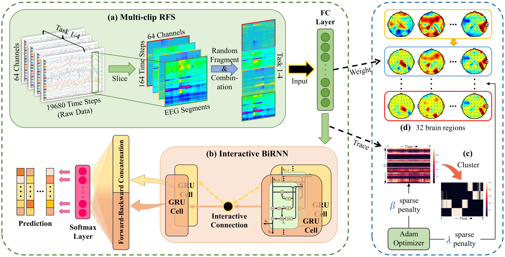
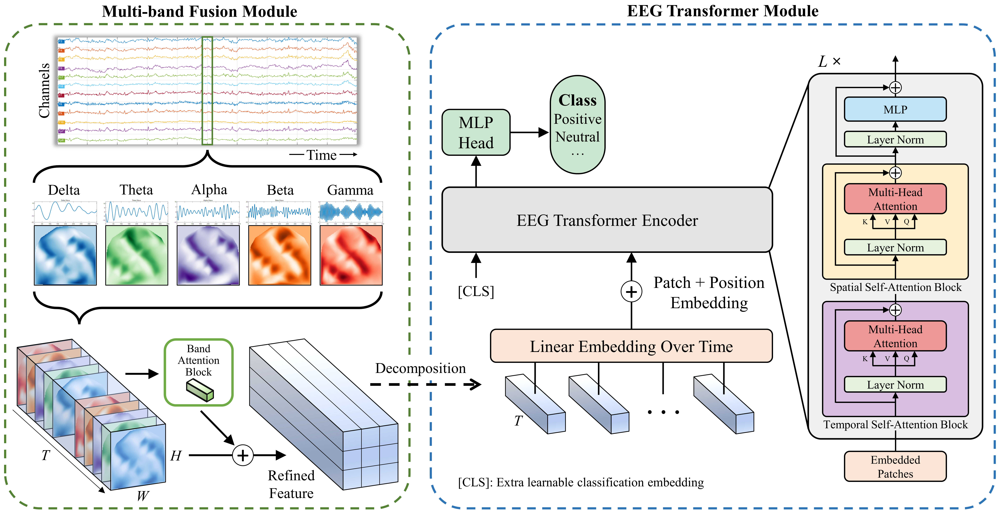
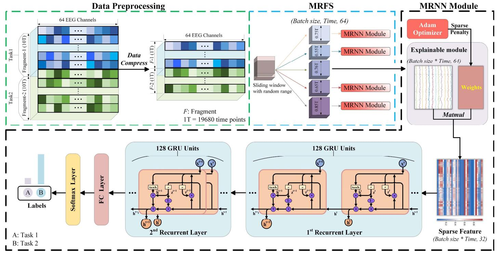
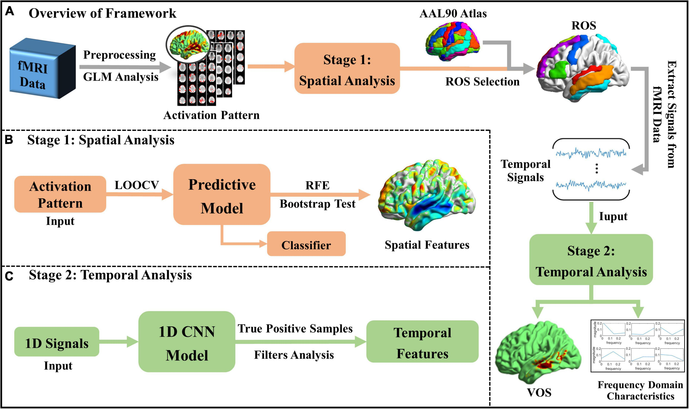

## 
 ——2024届硕士研究生——

#### 
  :small_blue_diamond::small_blue_diamond::small_blue_diamond::small_blue_diamond::small_blue_diamond:&emsp;史恩泽&emsp;:small_blue_diamond::small_blue_diamond::small_blue_diamond::small_blue_diamond::small_blue_diamond:

    

        &emsp;&emsp;史恩泽，计算机学院2024届硕士研究生，师从张枢教授，中共党员，研究方向为EEG脑电信号处理与脑机接口。在校期间曾担任计算机学院研究生第九党支部组织委员。曾获国家奖学金、一等学业奖学金、校优秀研究生等奖励及荣誉，并获研究生优秀毕业生称号。以学生第一作者发表两篇SCI论文（1篇一区，1篇二区），作为共同作者参与并发表高水平论文10篇，申请并公开国家发明专利4项，主持西北工业大学研究生创新基金1项，参与国家级纵向项目两项，横向课题一项。毕业后，他将继续在本校于本团队攻读博士学位，以科技创新实现科研报国的崇高理想。

  &emsp;**毕业去向**：西北工业大学计算机学院，攻读博士学位

  &emsp;**毕业寄语**：学识成就翱翔之翼，勤奋书写人生华章。
    

### · 研究方向
EEG脑电信号处理，脑机接口

### · 邮箱
ezshi@mail.nwpu.edu.cn

### · 代表论文

| 方法                | 题目                                                         | 链接                       |
| ----------------------- | ------------------------------------------------------------ | -------------------------- |
|  | Shu Zhang\*, **Enze Shi**\*, Lin Wu, Ruoyang Wang, Sigang Yu, Zhengliang Liu, Shaochen Xu, Tianming Liu, Shijie Zhao. Differentiating Brain States via Multi-clip Random Fragment Strategy-Based Interactive Bidirectional Recurrent Neural Network. Neural Networks, 2023. (Accepted) | [[PaperLink]]() [[Code]]() |
|  | **Enze Shi**, Sigang Yu, Yanqing Kang, Jinru Wu, Lin Zhao, Weizhong Liu, Dajiang Zhu, Jinglei Lv, Tianming Liu, Xintao Hu, Shu Zhang. MEET: Multi-band EEG Transformer. IEEE Transactions on Biomedical Engineering (T-BME), 2023. (under review) | [[PaperLink]]() [[Code]]() |
|  | Shu Zhang\*, Lin Wu\*, Sigang Yu, **Enze Shi**, Ning Qiang, Huan Gao, Jingyi Zhao, Shijie Zhao. An Explainable and Generalizable Recurrent Neural Network Approach for Differentiating Human Brain States on EEG Dataset[J]. IEEE Transactions on Neural Networks and Learning Systems, 2022: 1-12. | [[PaperLink]](https://ieeexplore.ieee.org/abstract/document/9940311) [[Code]]() |
|  | Sigang Yu, **Enze Shi**, Ruoyang Wang, Shijie Zhao, Tianming Liu, Xi Jiang, Shu Zhang. A hybrid learning framework for fine-grained interpretation of brain spatiotemporal patterns during naturalistic functional magnetic resonance imaging. Frontiers in Human Neuroscience, 2022, 16. | [[PaperLink]](https://www.frontiersin.org/articles/10.3389/fnhum.2022.944543/full) [[Code]]() |
|  | Shu Zhang\*, Jinru Wu\*, **Enze Shi**, Sigang Yu, Yongfeng Gao, Lihong Connie Li, Licheng Ryan Kuo, Zhengrong Liang. MM-GLCM-CNN: A Multi-scale and Multi-level based GLCM-CNN for Polyp Classification. Computerized Medical Imaging and Graphics, 2023. | [[PaperLink]]() [[Code]]() |
|  | Shu Zhang\*, Jinru Wu\*, Sigang Yu, Ruoyang Wang, **Enze Shi**, Yongfeng Gao, Zhengrong Liang. A Bagging Strategy-Based Multi-scale Texture GLCM-CNN Model for Differentiating Malignant from Benign Lesions Using Small Pathologically Proven Dataset. Multiscale Multimodal Medical Imaging: Third International Workshop, MMMI 2022. | [[PaperLink]](https://link.springer.com/chapter/10.1007/978-3-031-18814-5_5) [[Code]]() |
|  | Shu Zhang\*, Yanqing Kang\*, Sigang Yu, Jinru Wu, **Enze Shi**, Ruoyang Wang, Zhibin He, Lei Du, Tuo Zhang. A Novel Two-Stage Multi-view Low-Rank Sparse Subspace Clustering Approach to Explore the Relationship Between Brain Function and Structure. Machine Learning in Medical Imaging: 13th International Workshop, MLMI 2022. | [[PaperLink]](https://link.springer.com/chapter/10.1007/978-3-031-21014-3_20) [[Code]]() |

### · 出版论文
[1] Shu Zhang*, Enze Shi*, Lin Wu, Ruoyang Wang, Sigang Yu, Zhengliang Liu, Shaochen Xu, Tianming Liu, Shijie Zhao. Differentiating Brain States via Multi-clip Random Fragment Strategy-Based Interactive Bidirectional Recurrent Neural Network. Neural Networks, 2023. (under review)

[2] Enze Shi, Sigang Yu, Yanqing Kang, Jinru Wu, Lin Zhao, Weizhong Liu, Dajiang Zhu, Jinglei Lv, Tianming Liu, Xintao Hu, Shu Zhang. MEET: Multi-band EEG Transformer. IEEE Transactions on Biomedical Engineering (T-BME), 2023. (under review)

[3] Shu Zhang, Lin Wu, Sigang Yu, Enze Shi, Ning Qiang, Huan Gao, Jingyi Zhao, Shijie Zhao. An Explainable and Generalizable Recurrent Neural Network Approach for Differentiating Human Brain States on EEG Dataset[J]. IEEE Transactions on Neural Networks and Learning Systems, 2022: 1-12.

[4] Sigang Yu, Enze Shi, Ruoyang Wang, Shijie Zhao, Tianming Liu, Xi Jiang, Shu Zhang. A hybrid learning framework for fine-grained interpretation of brain spatiotemporal patterns during naturalistic functional magnetic resonance imaging[J]. Frontiers in Human Neuroscience, 2022, 16.

[5] Shu Zhang, Jinru Wu, Sigang Yu, Ruoyang Wang, Enze Shi, Yongfeng Gao, Zhengrong Liang. A Bagging Strategy-Based Multi-scale Texture GLCM-CNN Model for Differentiating Malignant from Benign Lesions Using Small Pathologically Proven Dataset[C]//Multiscale Multimodal Medical Imaging: Third International Workshop, MMMI 2022, Held in Conjunction with MICCAI 2022, Singapore, September 22, 2022, Proceedings. Cham: Springer Nature Switzerland, 2022.

[6] Shu Zhang, Jinru Wu, Enze Shi, Sigang Yu, Yongfeng Gao, Lihong Connie Li, Licheng Ryan Kuo, Zhengrong Liang. MM-GLCM-CNN: A Multi-scale and Multi-level based GLCM-CNN for Polyp Classification. Computerized Medical Imaging and Graphics, 2023. (under Review)

[7] Shu Zhang, Yanqing Kang, Sigang Yu, Jinru Wu, Enze Shi, Ruoyang Wang, Zhibin He, Lei Du, Tuo Zhang. A Novel Two-Stage Multi-view Low-Rank Sparse Subspace Clustering Approach to Explore the Relationship Between Brain Function and Structure. Machine Learning in Medical Imaging: 13th International Workshop, MLMI 2022, Held in Conjunction with MICCAI 2022, Singapore, September 18, 2022, Proceedings. Cham: Springer Nature Switzerland, 2022: 191-200.

<!-- 
# 友链

{{< friend name="{友链打开房间雷克离开对方名}" url="{友链地址}" logo="photo.jpg" word="{友链描述}" >}}
{{< friend name="{友链名}" url="{友链地址}" logo="images/logo.png" word="{友链描述}" >}}


 -->
