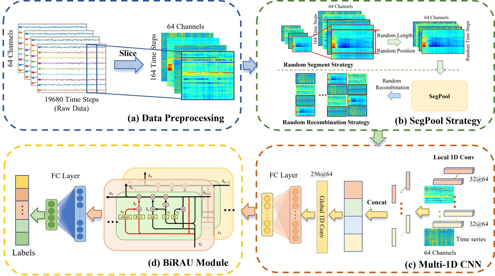

## 
 ——2025届硕士研究生——

#### 
  :small_blue_diamond::small_blue_diamond::small_blue_diamond::small_blue_diamond::small_blue_diamond:&emsp;胡华文&emsp;:small_blue_diamond::small_blue_diamond::small_blue_diamond::small_blue_diamond::small_blue_diamond:

    

        &emsp;&emsp;胡华文，计算机学院计算机科学与技术专业2022级硕士研究生，师从张枢教授。在攻读硕士学位期间，以第一作者身份发表论文三篇，合作参与论文数十篇，申请发明专利1项；参与国家级项目2项，并多次参加竞赛并获奖。曾荣获铂力特三等奖学金、一等学业奖学金、优秀研究生、优秀毕业生等多项荣誉。同时，积极投身志愿服务，曾担任中国机器人大赛和CCIG大会志愿者，并获评“优秀志愿者”称号。硕士毕业后，将继续在西北工业大学计算机学院攻读博士学位。
   
&emsp;**毕业去向**：西北工业大学计算机学院，攻读博士学位

&emsp;**毕业寄语**：博观而约取，厚积而薄发。

### · 研究方向
EEG脑电信号分析，脑控无人机、机器人

### · 邮箱
huawenhu@mail.nwpu.edu.cn

### · 代表论文

| 方法                | 题目                                                         | 链接                       |
| ----------------------- | ------------------------------------------------------------ | -------------------------- |
|  | **Huawen Hu**, Chenxi Yue, Enze Shi, Sigang Yu, Yanqing Kang, Jinru Wu, Jiaqi Wang, Shu Zhang. Effective Human Motor Imagery Recognition via Segments Pool Based 1D-CNN-Bidirectional Recurrent Attention Unit Network. 26th International Conference on Medical Image Computing and Computer Assisted Intervention, MICCAI 2023. (under review) | [[PaperLink]]() [[Code]]() |

### · 出版论文
[1] Huawen Hu, Chenxi Yue, Enze Shi, Sigang Yu, Yanqing Kang, Jinru Wu, Jiaqi Wang, Shu Zhang. Effective Human Motor Imagery Recognition via Segments Pool Based 1D-CNN-Bidirectional Recurrent Attention Unit Network. 26th International Conference on Medical Image Computing and Computer Assisted Intervention, MICCAI 2023. (under review)